# Architecture — DMD Clinical Trial Intelligence

This document explains how the pieces of the pipeline fit together: what
calls what, where data lives, and which parts are swappable.

> **2026-07-23 architecture change:** the original design ran four
> independent domain agents (literature/trials/biomarker/regulatory), each
> retrieving and answering separately, then synthesized by a Reporting
> Agent. That fan-out has been replaced by a single retrieve → answer
> pipeline (`rag/pipeline.py`), merged in along with a knowledge graph,
> query/feedback monitoring, and an MCP server from a companion "FAIR
> Scientific Data Discovery Platform" project. `agents/orchestrator.py`,
> `agents/base.py`, `agents/reporting_agent.py`, and the four
> `agents/*_agent.py` files are gone; the domain split survives only as a
> `source_type` filter, not as separate agents.

## High-level flow

```mermaid
flowchart TD
    subgraph Interfaces
        UI[Streamlit UI<br/>ui/app.py]
        API[FastAPI service<br/>api/main.py]
        MCP[MCP stdio server<br/>mcp_server/server.py]
    end

    UI --> PIPE
    API --> PIPE
    MCP --> PIPE

    subgraph Pipeline["rag/pipeline.py"]
        PIPE[ask&#40;question, top_k&#41;]
    end

    PIPE --> RET
    PIPE --> LLM[agents/llm.py<br/>generate]
    PIPE --> MON[monitoring/feedback.py<br/>log_query]

    subgraph RAG["Retrieval (rag/)"]
        RET[retrieve.py<br/>dedup + optional rerank]
        STORE[embed_store.py<br/>TF-IDF or HF+Chroma index]
        CHUNK[chunk.py]
        CORPUS[corpus.py]
    end

    RET --> STORE
    STORE --> CORPUS
    CORPUS --> CHUNK
    CORPUS --> DATA[(data/raw/*.json)]

    UI --> COMP[Comparison Agent<br/>agents/comparison.py]
    API --> COMP
    MCP --> COMP
    COMP --> CORPUS
    COMP --> LLM

    UI --> PDF[reports/pdf.py]
    COMP -.rows/summary.-> PDF
    PIPE -.summary/citations.-> PDF

    subgraph FAIRSUB["fair/ (merged FAIR-scoring catalog)"]
        FAIRSVC[service.py]
        FAIRSCORE[fair_fairsfair.py]
        RESOLVER[resolver.py]
        CATALOG[(fair/dmd_datasets.json<br/>15 records)]
    end
    FAIRSVC --> FAIRSCORE
    FAIRSVC --> RESOLVER
    FAIRSVC --> CATALOG
    UI --> FAIRSVC
    API --> FAIRSVC
    MCP --> FAIRSVC

    subgraph KG["knowledge_graph/kg.py"]
        GRAPH[build_kg over fair/ catalog<br/>shared source/type/entities]
    end
    GRAPH --> CATALOG
    UI --> GRAPH
    API --> GRAPH
    MCP --> GRAPH
    PIPE -."related_for_citations<br/>(best-effort, opportunistic)".-> GRAPH

    subgraph Ingestion["ingestion/ (offline, run manually)"]
        FT[fetch_trials.py]
        FL[fetch_literature.py]
        FB[fetch_biomarker.py]
        FR[fetch_regulatory.py]
    end

    FT -.writes.-> DATA
    FL -.writes.-> DATA
    FB -.writes.-> DATA
    FR -.writes.-> DATA
```

## Request lifecycle

1. A question arrives via the **Streamlit UI** (`ui/app.py`), the
   **FastAPI endpoint** (`api/main.py`, `POST /query`), or the **MCP
   server**'s `ask` tool (`mcp_server/server.py`).
2. **`rag/pipeline.py`'s `ask()`** calls `rag/retrieve.py` once across the
   *whole* corpus (no per-domain split) to fetch the top-k matching
   evidence, then calls `agents/llm.py`'s `generate()` to turn that
   evidence into an answer.
3. `rag/retrieve.py` over-fetches from the vector store built by
   `rag/embed_store.py` (itself built from `Document` objects produced by
   `rag/corpus.py`, chunked by `rag/chunk.py`), then **dedups to the
   highest-scoring chunk per citation** and optionally reranks with a
   cross-encoder (`RERANK=1`) before returning the top-k.
4. `ask()` logs the query via `monitoring/feedback.py`, opportunistically
   cross-references each citation against the `fair/` catalog's knowledge
   graph (`knowledge_graph.kg.related_for_citations` — most citations won't
   match, since the two datasets barely overlap by ID; that's expected, not
   a bug), and returns a `Report` (summary + citations + optional note).
5. The UI/API renders `Report.summary`, `Report.citations`, and any
   matched related records, plus a 👍/👎 feedback control that calls
   `monitoring/feedback.log_feedback` directly (UI) or `POST /feedback`
   (API).

## Comparison flow (trials / literature / regulatory)

Unchanged by the architecture change above — this flow never went through
the orchestrator. The three structured comparison tables don't go through
the retriever either: a comparison needs one specific record's full data,
not "the single best-matching chunk of it." `agents/comparison.py` instead:

1. Loads the full, unchunked corpus once per process (`rag/corpus.load_all()`,
   cached module-level) and looks records up directly by NCT ID or PMID.
2. Builds each table row from real structured fields where the source
   has them (phase, enrollment, eligibility criteria, outcomes for
   trials; PMID/journal/year for literature), and via `agents/llm.py`'s
   `extract_fields()` for literature fields PubMed doesn't expose
   structurally (disease area, sample size, biomarker, etc.) -- which
   only works when `LLM_MODE=llm`; otherwise those cells read "Not
   available (offline mode)" rather than guessing.
3. Turns the row set into a synthetic evidence list and reuses
   `agents/llm.py`'s existing `generate()` for the narrative summary, so
   the same extractive/LLM fallback behavior applies here too.
4. `shortlist()` caps any UI picker or API candidate list at 10 results
   (`comparison.TOP_K_DEFAULT`), with a note when more exist -- the
   trials corpus alone has 300+ records, so nothing lists them all
   unfiltered.

Regulatory insights are simpler: `load_regulatory_guidance()` just reads
`data/raw/regulatory_guidance_dmd.json` (curated FDA/EMA guidance
metadata) directly -- no retrieval or LLM call involved.

## FAIR-ness catalog (`fair/`) and knowledge graph (`knowledge_graph/`)

Merged in from two other projects (`dmd_platform`, then `fair-discovery`),
in that order:

- **`fair/`** is a separate, standards-based FAIR-ness scoring catalog: 15
  curated records (GEO/ChEMBL/ClinicalTrials/PubMed) scored against the
  FAIRsFAIR/F-UJI metrics (`fair/fair_fairsfair.py`), with an accession
  resolver (`fair/resolver.py`) and glue code (`fair/service.py`) the rest
  of the app imports. See `fair/README.md`.
- **`knowledge_graph/kg.py`** builds a `networkx` graph over that same
  15-record catalog, weighting edges by shared `source` (+1), `type` (+1),
  and `entities` (+0.5 each) — the same edge logic fair-discovery used for
  shared organism/platform/keywords over GEO records, adapted to this
  catalog's fields. It is **deliberately not** built over the full
  353-trial RAG corpus: those records have no curated entity/keyword
  fields, and only sparsely overlap the `fair/` catalog's IDs, so a graph
  over them would mean inventing keywords rather than reusing real ones.
  `related_for_citations()` does the best-effort cross-referencing from
  the main corpus into this graph (see step 4 above); `related_datasets()`
  is the direct lookup used by the FAIR Catalog tab, `GET /related/{id}`,
  and the MCP server's `related_datasets` tool.

## MCP server (`mcp_server/server.py`)

Exposes 6 tools over stdio for MCP clients/agents: `search_datasets`,
`get_dataset`, `ask`, `related_datasets`, `fair_score`, `catalog_stats`.
Each wraps the equivalent piece directly (`rag.retrieve`/`rag.corpus` for
search/get, `rag.pipeline` for ask, `knowledge_graph.kg` for
related_datasets, `fair.service` for fair_score) rather than a single
bundled "Platform" object, since this project has no equivalent of that.
Run with `python -m mcp_server.server` (needs `pip install -r
requirements-mcp.txt`).

## PDF export (`reports/pdf.py`)

Every table/answer in the UI has a "Download as PDF" button, built with
`fpdf2` -- pure Python, no system-level dependencies (no
wkhtmltopdf/Pango/Cairo to install), consistent with keeping this
deployment lightweight. `reports/pdf.py` exposes three builder functions
(`comparison_pdf`, `guidance_pdf`, `answer_pdf`), all reusing the same
branded `_ReportPDF` base class (optional logo + navy title in the header,
page-numbered footer) and the same `fpdf2`-native `table()` helper for
row rendering. One thing worth knowing if you touch this file: the core
Helvetica font is latin-1 only, so free-text corpus fields (eligibility
criteria, abstracts) can contain characters like "≥" that would otherwise
crash generation -- `_sanitize()` maps the common cases to ASCII and
replaces anything else, rather than pulling in a full Unicode font for a
handful of stray characters.

## Key design principles

- **Evidence-first, not prose-first.** `rag/retrieve.py` returns structured
  `EvidencePacket` objects (citation, URL, source type, score), never
  free-form paraphrased text, so the final answer can always be traced
  back to a specific source. See `rag/pipeline.py`.
- **Pluggable generation backend.** `agents/llm.py` supports two modes via
  the `LLM_MODE` env var:
  - `extractive` (default) — no LLM call, just templates the retrieved
    evidence into a cited summary. Fully offline.
  - `llm` — calls any OpenAI-compatible chat endpoint (Ollama, llama.cpp,
    Groq, HF Inference). Falls back to the extractive summary
    automatically if the call fails, so a network hiccup never breaks the
    demo.
- **Pluggable vector store.** `rag/embed_store.py` supports two backends
  via the `EMBEDDING_BACKEND` env var:
  - `tfidf` (default) — scikit-learn TF-IDF + cosine similarity, fully
    offline, persisted to `data/index_tfidf.pkl`.
  - `hf` — `sentence-transformers` (`BAAI/bge-base-en-v1.5`) + Chroma,
    the production path once there's normal internet access. The same
    optional dependency also powers `rag/retrieve.py`'s `RERANK=1`
    cross-encoder rerank.
- **One retriever, not four agents.** `rag/pipeline.py`'s `ask()` searches
  the whole corpus in one call rather than fanning out to per-domain
  agents — simpler, and the `source_type` filter is still available to
  anything that needs it (`agents/comparison.py`'s per-tab lookups do).
- **Ingestion is decoupled and offline-tolerant.** The `ingestion/`
  scripts hit live public APIs (ClinicalTrials.gov, PubMed, ChEMBL/Open
  Targets, openFDA) and write straight into `data/raw/*.json`. They are
  meant to be re-run manually/periodically, not called at request time —
  the rest of the pipeline only ever reads the JSON snapshots.
- **The index loads once per process, not once per request.**
  `rag/embed_store.get_store()` caches the loaded `TfidfStore`/`HFChromaStore`
  in a module-level dict keyed by backend, and `knowledge_graph.kg.get_graph()`
  does the same for the FAIR catalog graph. The API and UI each pay the
  load cost once at startup; every request afterward just searches the
  already-loaded index/graph in memory. (The TF-IDF pickle itself is
  stored as a plain dict of its fitted vectorizer/matrix/docs, not the
  `TfidfStore` instance — pickling the instance directly breaks across
  processes because `python -m rag.embed_store` gives the class a
  `__main__` module identity that a different process's `__main__` can't
  resolve.)
- **Results are capped, not dumped.** `rag/pipeline.TOP_K_DEFAULT` and
  `agents/comparison.TOP_K_DEFAULT` are both 10 — every answer and every
  comparison picker shows at most 10 items, with a `note` field
  (`Report.note`, `Shortlist.note`) surfaced in the UI/API when more
  exist, rather than silently truncating.
- **Observability without a database.** `monitoring/feedback.py` appends
  plain JSONL rows (`data/query_log.jsonl`, `data/feedback_log.jsonl`) —
  no server, no schema migration, easy to inspect or delete for a fresh
  demo.

## Data status (as of last ingestion run)

| Source | File | Status |
|---|---|---|
| ClinicalTrials.gov | `data/raw/trials_dmd.json` | Real data, pulled live — interventional DMD trials only, including eligibility criteria, primary outcomes, and posted results where available |
| PubMed | `data/raw/literature_dmd.json` | Real data, pulled live — any answer using it must cite PubMed + DOI |
| ChEMBL / Open Targets | `data/raw/biomarker_dmd.json` | Real data, pulled live |
| openFDA | `data/raw/regulatory_dmd.json` | **Seed data only**, flagged `needs_verification` — wire `ingestion/fetch_regulatory.py` before treating as ground truth |
| FDA / EMA (hand-curated) | `data/raw/regulatory_guidance_dmd.json` | **Seed data**, manually curated and dated general trial-design guidance (eligibility, diversity, decentralized trials, RWE, rare disease, accelerated approval) — distinct from the drug-approval history above; re-verify status fields before relying on them, some items are explicitly flagged draft/unresolved |
| GEO/ChEMBL/ClinicalTrials/PubMed (curated) | `fair/dmd_datasets.json` | Separate 15-record FAIR-ness demo catalog, mostly disjoint from the files above -- see `fair/README.md` |

Current counts (drift as ingestion is re-run) are always available live via `GET /stats` or the Executive Dashboard tab — don't hardcode them elsewhere.

## Configuration (environment variables)

| Variable | Default | Effect |
|---|---|---|
| `LLM_MODE` | `extractive` | Set to `llm` to route generation (and literature-table field extraction) through an OpenAI-compatible endpoint |
| `OPENAI_API_BASE` | `http://localhost:11434/v1` | Endpoint used when `LLM_MODE=llm` |
| `MODEL_NAME` | `llama3.1` | Model name used when `LLM_MODE=llm` |
| `OPENAI_API_KEY` | `not-needed-for-local-ollama` | API key, if the endpoint requires one |
| `EMBEDDING_BACKEND` | `tfidf` | Set to `hf` to use sentence-transformers + Chroma instead of TF-IDF (needs `requirements-hf.txt`) |
| `RERANK` | `0` | Set to `1` to cross-encoder rerank retrieval results (needs `requirements-hf.txt`) |

## API endpoints (`api/main.py`)

| Endpoint | Purpose |
|---|---|
| `GET /health` | Liveness check |
| `GET /stats` | Corpus counts (trials/publications/regulatory/biomarker) + query counter, for the Executive Dashboard |
| `POST /query`, `POST /generate-summary` | Same handler, two names — ask a question, get a cited answer + any FAIR-catalog related records (`generate-summary` matches the capstone brief's naming) |
| `POST /compare-trials` | `{"trialA": "NCT...", "trialB": "NCT..."}` → structured comparison table + narrative summary |
| `POST /compare-literature` | `{"pmidA": "...", "pmidB": "..."}` → same, for two PubMed articles |
| `POST /regulatory-insights` | Returns the FDA/EMA guidance table (no body needed) |
| `GET /fair/catalog`, `GET /fair/resolve` | The 15-record FAIR demo catalog and its accession resolver |
| `GET /related/{accession}` | Knowledge-graph neighbors of a fair/ catalog accession |
| `POST /feedback`, `GET /monitoring/stats` | Query/feedback logging and aggregate stats |

None of these rebuild the index per call — see "the index loads once per process" above.

## Entry points

| To do this... | Run this |
|---|---|
| Build/refresh the vector index | `python -m rag.embed_store` |
| Query from the command line | `python -c "from rag.pipeline import ask; print(ask('...').summary)"` |
| Start the API | `uvicorn api.main:app --reload --port 8000` |
| Start the UI | `streamlit run ui/app.py` |
| Start the MCP server | `python -m mcp_server.server` (needs `requirements-mcp.txt`) |
| Refresh raw data | `python -m ingestion.fetch_<trials\|literature\|biomarker\|regulatory>` |
| Run in Podman | See [DEPLOYMENT.md](DEPLOYMENT.md) |
