# Architecture

How the pieces fit together: what calls what, where data lives, and which
parts are swappable.

## High-level flow

```mermaid
flowchart TD
    subgraph Interfaces
        UI[Streamlit UI<br/>ui/app.py]
        API[FastAPI service<br/>api/main.py]
        MCP[MCP stdio server<br/>mcp_server/server.py]
    end

    UI --> PIPE
    API --> PIPE
    MCP --> PIPE

    subgraph Pipeline["rag/pipeline.py"]
        PIPE[ask&#40;question, top_k&#41;]
    end

    PIPE --> RET
    PIPE --> LLM[agents/llm.py<br/>generate]
    PIPE --> MON[monitoring/feedback.py<br/>log_query]

    subgraph RAG["Retrieval (rag/)"]
        RET[retrieve.py<br/>dedup + optional rerank]
        STORE[embed_store.py<br/>TF-IDF or HF+Chroma index]
        CHUNK[chunk.py]
        CORPUS[corpus.py]
    end

    RET --> STORE
    STORE --> CORPUS
    CORPUS --> CHUNK
    CORPUS --> DATA[(data/raw/*.json)]

    UI --> COMP[Comparison Agent<br/>agents/comparison.py]
    API --> COMP
    MCP --> COMP
    COMP --> CORPUS
    COMP --> LLM

    UI --> PDF[reports/pdf.py]
    COMP -.rows/summary.-> PDF
    PIPE -.summary/citations.-> PDF

    subgraph Ingestion["ingestion/ (offline, run manually)"]
        FT[fetch_trials.py]
        FL[fetch_literature.py]
        FB[fetch_biomarker.py]
        FR[fetch_regulatory.py]
    end

    FT -.writes.-> DATA
    FL -.writes.-> DATA
    FB -.writes.-> DATA
    FR -.writes.-> DATA
```

## Request lifecycle

1. A question arrives via the **Streamlit UI**, the **FastAPI endpoint**
   (`POST /query`), or the **MCP server**'s `ask` tool.
2. **`rag/pipeline.py`'s `ask()`** calls `rag/retrieve.py` once across the
   whole corpus (no per-domain split) to fetch the top-k matching evidence,
   then calls `agents/llm.py`'s `generate()` to turn that evidence into an
   answer.
3. `rag/retrieve.py` over-fetches from the vector store (`rag/embed_store.py`,
   built from `Document` objects in `rag/corpus.py`, chunked by
   `rag/chunk.py`), dedups to the highest-scoring chunk per citation, and
   optionally reranks with a cross-encoder (`RERANK=1`) before returning the
   top-k.
4. `ask()` logs the query via `monitoring/feedback.py` and returns a
   `Report` (summary + citations + optional note).
5. The UI/API renders the summary and citations, plus a 👍/👎 feedback
   control.

## Comparison flow (trials / literature / regulatory)

Comparisons don't go through the retriever -- a comparison needs one
specific record's full data, not the single best-matching chunk of it.
`agents/comparison.py` instead:

1. Loads the full, unchunked corpus once per process and looks records up
   directly by NCT ID or PMID.
2. Builds each table row from real structured fields where the source has
   them (phase, enrollment, eligibility criteria, outcomes for trials;
   PMID/journal/year plus NER-tagged disease area for literature), and via
   `agents/llm.py`'s `extract_fields()` for fields that need free-text
   summarization (sample size, study type, primary endpoint, key finding)
   -- which only works when `LLM_MODE=llm`; otherwise those cells read "Not
   available (offline mode)" rather than guessing.
3. Turns the row set into a synthetic evidence list and reuses
   `agents/llm.py`'s `generate()` for the narrative summary, so the same
   extractive/LLM fallback behavior applies here too.
4. `shortlist()` caps any UI picker or API candidate list at 10 results,
   with a note when more exist.

Regulatory insights are simpler: `load_regulatory_guidance()` just reads
`data/raw/regulatory_guidance_dmd.json` directly -- no retrieval or LLM
call involved.

## MCP server (`mcp_server/server.py`)

Exposes 4 tools over stdio for MCP clients/agents: `search_datasets`,
`get_dataset`, `ask`, `catalog_stats`. Run with `python -m mcp_server.server`
(needs `pip install -r requirements-mcp.txt`).

## PDF export (`reports/pdf.py`)

Every table/answer in the UI has a "Download as PDF" button, built with
`fpdf2` -- pure Python, no system-level dependencies. Exposes three
builder functions (`comparison_pdf`, `guidance_pdf`, `answer_pdf`), all
reusing the same branded `_ReportPDF` base class and the same `fpdf2`-native
`table()` helper for row rendering. The core Helvetica font is latin-1
only, so free-text fields (eligibility criteria, abstracts) that contain
characters like "≥" go through `_sanitize()` first.

## Key design principles

- **Evidence-first, not prose-first.** `rag/retrieve.py` returns structured
  `EvidencePacket` objects (citation, URL, source type, score), never
  free-form paraphrased text, so any answer can be traced back to a
  specific source.
- **Pluggable generation backend.** `agents/llm.py` supports two modes via
  the `LLM_MODE` env var:
  - `extractive` (default) -- no LLM call, templates the retrieved
    evidence into a cited summary. Fully offline.
  - `llm` -- calls any OpenAI-compatible chat endpoint (Ollama, llama.cpp,
    Groq, HF Inference). Falls back to the extractive summary
    automatically if the call fails.
- **Pluggable vector store.** `rag/embed_store.py` supports two backends
  via `EMBEDDING_BACKEND`:
  - `tfidf` (default) -- scikit-learn TF-IDF + cosine similarity, fully
    offline, persisted to `data/index_tfidf.pkl`.
  - `hf` -- `sentence-transformers` (`BAAI/bge-base-en-v1.5`) + Chroma.
    Also powers `rag/retrieve.py`'s `RERANK=1` cross-encoder rerank.
- **One retriever, not per-domain agents.** `rag/pipeline.py`'s `ask()`
  searches the whole corpus in one call. The `source_type` filter is still
  available to anything that needs it (`agents/comparison.py`'s per-tab
  lookups do).
- **Ingestion is decoupled and offline-tolerant.** The `ingestion/` scripts
  hit live public APIs (ClinicalTrials.gov, PubMed, ChEMBL/Open Targets,
  openFDA) and write straight into `data/raw/*.json`. They're meant to be
  re-run manually/periodically, not called at request time -- the rest of
  the pipeline only ever reads the JSON snapshots.
- **The index loads once per process, not once per request.**
  `rag/embed_store.get_store()` caches the loaded store in a module-level
  dict; the API and UI each pay the load cost once at startup.
- **Results are capped, not dumped.** Every answer and comparison picker
  shows at most 10 items by default, with a note when more exist.
- **Observability without a database.** `monitoring/feedback.py` appends
  plain JSONL rows (`data/query_log.jsonl`, `data/feedback_log.jsonl`) --
  no server, no schema migration.

## Data sources

| Source | File | Nature |
|---|---|---|
| ClinicalTrials.gov | `data/raw/trials_dmd.json` | Live-pulled |
| PubMed | `data/raw/literature_dmd.json` | Live-pulled; cite PubMed + DOI in any answer using it |
| ChEMBL / Open Targets | `data/raw/biomarker_dmd.json` | Live-pulled |
| Clinical endpoints | `data/raw/biomarker_endpoints_dmd.json` | Hand-curated, no live source |
| openFDA + drug approvals | `data/raw/regulatory_dmd.json` | Mix of live-verified and hand-curated -- see each entry's `status` field |
| FDA / EMA guidance | `data/raw/regulatory_guidance_dmd.json` | Hand-curated, no live source -- re-verify periodically |

Current counts are always available live via `GET /stats`, the Executive
Dashboard tab, or `GET /dashboard`.

## Configuration (environment variables)

| Variable | Default | Effect |
|---|---|---|
| `LLM_MODE` | `extractive` | Set to `llm` to route generation (and literature-table field extraction) through an OpenAI-compatible endpoint |
| `OPENAI_API_BASE` | `http://localhost:11434/v1` | Endpoint used when `LLM_MODE=llm` |
| `MODEL_NAME` | `llama3.1` | Model name used when `LLM_MODE=llm` |
| `OPENAI_API_KEY` | `not-needed-for-local-ollama` | API key, if the endpoint requires one |
| `EMBEDDING_BACKEND` | `tfidf` | Set to `hf` to use sentence-transformers + Chroma instead of TF-IDF (needs `requirements-hf.txt`) |
| `RERANK` | `0` | Set to `1` to cross-encoder rerank retrieval results (needs `requirements-hf.txt`) |

## API endpoints (`api/main.py`)

| Endpoint | Purpose |
|---|---|
| `GET /health` | Liveness check |
| `GET /stats` | Corpus counts + query counter |
| `GET /dashboard` | Static corpus-size snapshot |
| `POST /query`, `POST /generate-summary` | Same handler, two names -- ask a question, get a cited answer |
| `POST /compare-trials` | `{"trialA": "NCT...", "trialB": "NCT..."}` -> structured comparison table + narrative summary |
| `POST /compare-literature` | `{"pmidA": "...", "pmidB": "..."}` -> same, for two PubMed articles |
| `POST /regulatory-insights` | Returns the FDA/EMA guidance table |
| `POST /feedback`, `GET /monitoring/stats` | Query/feedback logging and aggregate stats |

## Entry points

| To do this... | Run this |
|---|---|
| Build/refresh the vector index | `python -m rag.embed_store` |
| Query from the command line | `python -c "from rag.pipeline import ask; print(ask('...').summary)"` |
| Start the API | `uvicorn api.main:app --reload --port 8000` |
| Start the UI | `streamlit run ui/app.py` |
| Start the MCP server | `python -m mcp_server.server` (needs `requirements-mcp.txt`) |
| Refresh raw data | `python -m ingestion.fetch_<trials\|literature\|biomarker\|regulatory>` |
| Run in Podman | See [DEPLOYMENT.md](DEPLOYMENT.md) |
